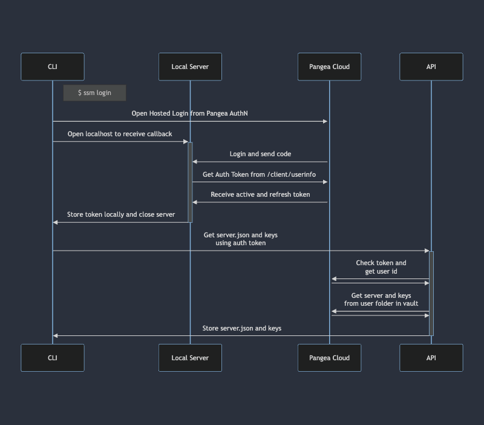
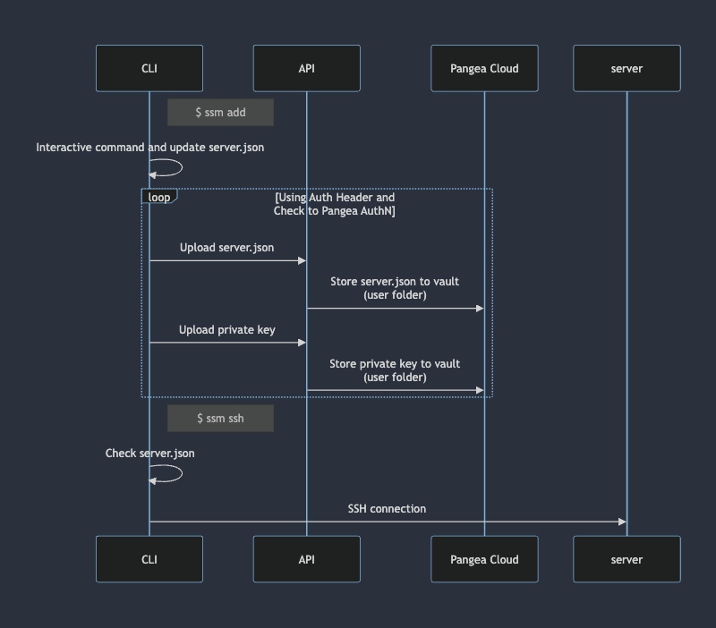

# Secure SSH Manager (SSM)

Backup SSH configuration and server configuration.

## How to Run

- Use python > 3.10 and poetry for package manager
- `poetry install`
- `chmod +x ssm`
- `./ssm --help`

## Commands

Command | Description
--- | --- 
login | Login and download ssh key and server configuration
add | Add new server configuration
ssh | Select server to connect
logout | Logout and delete all configuration

## How it works

